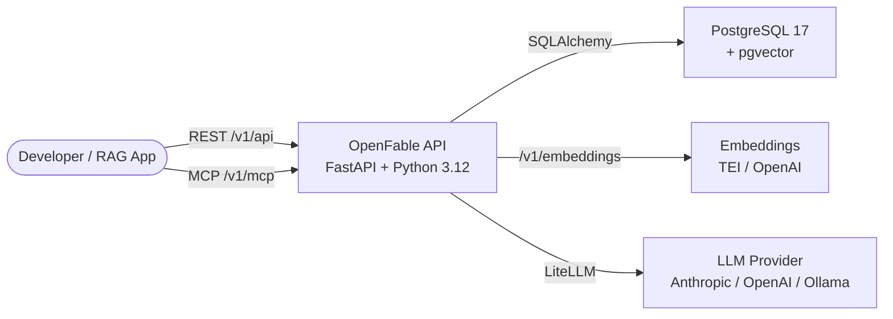

# OpenFable

An open-source retrieval engine implementing [FABLE](https://arxiv.org/abs/2601.18116) (Forest-Based Adaptive Bi-Path LLM-Enhanced Retrieval). OpenFable accepts documents as raw text, builds LLM-enhanced semantic forest indexes, and retrieves relevant content through bi-path retrieval with adaptive budget control.

Retrieval only -- OpenFable returns ranked chunks, not generated answers. Bring your own LLM for generation.

## Why FABLE?

Most RAG systems chunk documents into flat segments and retrieve by vector similarity. This works for simple queries but breaks down when:

- A question spans multiple sections of a document
- The answer requires understanding how sections relate to each other
- You need to control how many tokens you send to the LLM
- Relevant content is buried in a subsection that doesn't match the query's surface-level keywords

FABLE solves this by building a **semantic forest** -- a tree structure where each document becomes a hierarchy of nodes (root, sections, subsections, leaves). Retrieval then uses two complementary paths at each level:

1. **LLM-guided path** -- an LLM reasons about which documents and subtrees are relevant based on their summaries and table-of-contents structure
2. **Vector path** -- embedding similarity search over the same tree nodes, with structure-aware score propagation (TreeExpansion)

Results from both paths are fused, deduplicated, and trimmed to fit within a token budget you specify.

## How It Works

### Ingestion

When you POST a document, OpenFable:

1. **Semantic chunking** -- an LLM identifies discourse boundaries and splits the text into coherent chunks (not fixed-size windows)
2. **Tree construction** -- chunks are organized into a hierarchical tree. The LLM generates summaries for internal nodes, creating a table-of-contents-like structure
3. **Multi-granularity embedding** -- every node (root, section, subsection, leaf) gets a BGE-M3 embedding. Internal nodes embed their `toc_path + summary`; leaves embed their raw content
4. **Indexing** -- embeddings are stored in pgvector with HNSW indexes for fast similarity search

### Retrieval

When you POST a query with a `token_budget`:

**Document level** -- which documents matter?
- **LLMselect**: the LLM sees shallow tree nodes (toc paths + summaries) and scores document relevance
- **Vector top-K**: cosine similarity search over internal node embeddings, aggregated to document level
- Results are fused (union, max-score)

**Budget routing** -- if the fused documents fit within your token budget, their full content is returned. If not, retrieval drills down to node level.

**Node level** -- which chunks matter?
- **LLMnavigate**: the LLM sees the full tree hierarchy and selects relevant subtree roots
- **TreeExpansion**: structure-aware scoring using `S(v) = 1/3[S_sim + S_inh + S_child]` -- similarity with depth decay, ancestor inheritance, and child aggregation propagate relevance through tree edges
- Results are fused with LLM-guided nodes getting priority, then greedily selected up to the token budget

The result: you get the most relevant chunks, in document order, within your token budget -- using both LLM reasoning and structural context, not just embedding distance.

## Architecture



## Configuration

All settings are controlled by environment variables (no `.env` file). Every variable uses the `OPENFABLE_` prefix.

| Variable | Default | Description |
|----------|---------|-------------|
| `OPENFABLE_DATABASE_URL` | `postgresql://openfable:openfable@db:5432/openfable` | PostgreSQL connection string |
| `OPENFABLE_LITELLM_MODEL` | `gpt-5.4` | LiteLLM model string |
| `OPENFABLE_LITELLM_API_KEY` | `""` | API key (set to your provider's key) |
| `OPENFABLE_LITELLM_BASE_URL` | `""` | LLM base URL (required for Ollama) |
| `OPENFABLE_EMBEDDING_URL` | `https://api.openai.com` | Embeddings service URL (OpenAI-compatible /v1/embeddings) |
| `OPENFABLE_EMBEDDING_MODEL` | `text-embedding-3-small` | Embedding model ID |
| `OPENFABLE_EMBEDDING_API_KEY` | `""` | Embedding API key (required for OpenAI embeddings, empty for TEI) |
| `OPENFABLE_EMBEDDING_DIMENSIONS` | `1024` | Embedding vector dimensions (must match pgvector schema) |
| `OPENFABLE_EMBEDDING_BATCH_SIZE` | `64` | Batch size for embedding calls |
| `OPENFABLE_RETRIEVAL_TOP_K` | `10` | Vector candidate count for retrieval |
| `OPENFABLE_RETRIEVAL_LLMSELECT_DEPTH` | `2` | Tree depth limit for LLMselect (non-leaf nodes at depth ≤ L are shown to the LLM for document selection) |
| `OPENFABLE_DEBUG` | `false` | Enable SQL query logging and LLM input/output logging |

The minimum change to get started is setting `OPENFABLE_LITELLM_API_KEY` to your OpenAI API key.

## API Reference

Full request/response schemas are available at `http://localhost:8000/docs` (auto-generated OpenAPI).

### REST API (`/v1/api`)

| Method | Endpoint | Description | Key Parameters |
|--------|----------|-------------|----------------|
| `POST` | `/v1/api/documents` | Ingest a document (synchronous) | `text` (string, required), `metadata` (object) |
| `GET` | `/v1/api/documents` | List all documents with index status | -- |
| `GET` | `/v1/api/documents/{id}` | Get document with content | `?meta_only=true` to omit content |
| `POST` | `/v1/api/query` | Bi-path retrieval with budget control | `query` (string), `token_budget` (100-32000) |
| `GET` | `/v1/api/health` | Health check for all components | -- |

### MCP Server (`/v1/mcp`)

All REST endpoints are also exposed as [MCP](https://modelcontextprotocol.io/) tools via SSE transport at `/v1/mcp/sse`. This lets LLM agents (Claude Desktop, Cursor, etc.) interact with OpenFable directly.

Connect with any MCP client using the SSE URL:

```
http://localhost:8000/v1/mcp/sse
```

## When to Use OpenFable

**Good fit:**
- You have long, structured documents (research papers, technical docs, legal contracts, manuals) and need to retrieve specific sections within a token budget
- You want retrieval quality that goes beyond flat vector search -- using document structure and LLM reasoning
- You're building a RAG pipeline and want a retrieval backend that handles chunking, indexing, and budget-aware retrieval so you can focus on generation

**Not a fit:**
- Short documents where flat chunking works fine
- Use cases where ingestion cost is a concern -- every document requires multiple LLM calls for chunking and tree construction
- You need sub-second retrieval latency -- the LLM-guided paths add a round-trip per retrieval level

## Security

OpenFable exposes document content through its API endpoints. In production deployments, place the API behind a reverse proxy or firewall to restrict access. The `GET /v1/api/documents/{id}` endpoint returns raw document text by default -- ensure this is not exposed to untrusted networks.

OpenFable does not include authentication or rate limiting. Use an API gateway (e.g., nginx, Traefik, Kong) in front of the API server for production use.

## Future Work

- **Usage examples** -- Real-world examples demonstrating large-scale document ingestion and retrieval across corpora too large to fit in a single LLM context window

## License

[Apache 2.0](LICENSE)

## Links

- [FABLE paper (arXiv:2601.18116)](https://arxiv.org/abs/2601.18116)
- [API documentation](http://localhost:8000/docs) (requires running instance)
