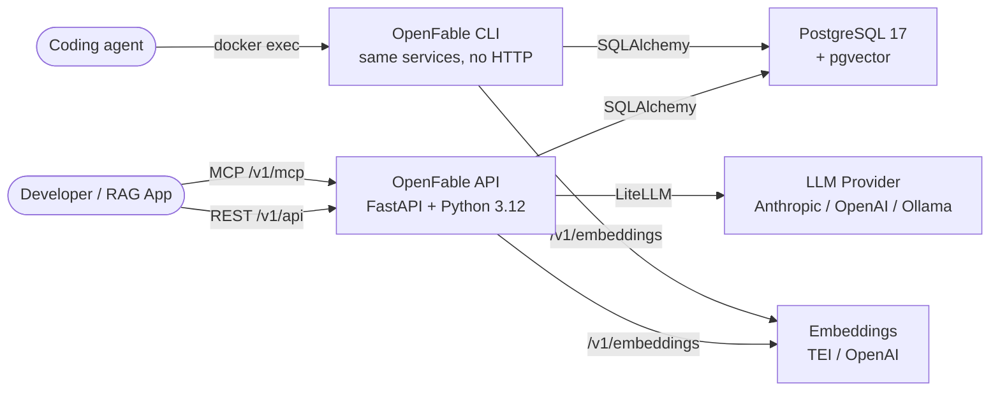

# OpenFable

[](https://github.com/alainbrown/openfable/actions/workflows/test.yml)
[](LICENSE)

An open-source retrieval engine implementing [FABLE](https://arxiv.org/abs/2601.18116) (Forest-Based Adaptive Bi-Path LLM-Enhanced Retrieval). OpenFable accepts documents as raw text, builds LLM-enhanced semantic forest indexes, and retrieves relevant content through bi-path retrieval with adaptive budget control.


## Agents start here

Install the plugin. It requires a published container image, so install from a tagged release rather than a bare `main` checkout.

```
/plugin marketplace add alainbrown/openfable
/plugin install openfable@openfable
```

Run from the directory holding the documents. That directory is mounted read-only at `/work` inside the container, so `./spec.md` is `/work/spec.md`.

OpenFable does not chunk documents. You read the document, choose the chunk boundaries, and build the tree. It resolves those boundaries to character offsets, persists them, embeds every node, scores retrieval, and enforces the token budget.

Index quality therefore depends on the agent, and we recommend a capable frontier model — Opus 5 or equivalent. Validation rejects structurally invalid input: a marker that is not verbatim, a missing or duplicated `chunk_index`, a malformed node. It cannot tell whether the boundaries fall at genuine topic changes, or whether a summary states what a subtree says rather than merely naming it. Those are judgments, and a weaker model degrades them without erroring.

The server path below does not have this variance: it runs the same pipeline in code, calling an LLM at `temperature=0` for the chunking and tree steps. The sequence is enforced rather than followed. Use it when indexing must be reproducible.

### First run

When `.openfable/preferences.json` is absent, the skill onboards: two questions about where PostgreSQL and embeddings should run, or skip for local containers of both. It writes

```
.openfable/
├── docker-compose.yml    generated from the answers
├── preferences.json      presence of this file skips onboarding
├── .env                  connection details, gitignored
└── .gitignore
```

Answer rather than skip when PostgreSQL or embeddings already exist elsewhere — a managed pgvector instance, or an OpenAI-compatible embeddings endpoint. Onboarding checks reachability, the `vector` and `ltree` extensions, and that the endpoint returns 1024-dimension vectors before writing anything.

Corpora are per-directory. Pointing several projects at one database shares a corpus between them.

### Indexing

Three steps. Each consumes the previous step's output, so they cannot be reordered or skipped.

| Step | Command | Output |
|------|---------|--------|
| 1 | `openfable plan <path>` | `document_id` |
| 2 | `openfable apply-chunks <id> -` | `chunk_index` set |
| 3 | `openfable apply-tree <id> -` | indexed document |

Commands print one JSON object. Failure prints `{"error": "..."}` and exits non-zero. Correct the input and re-run the same step; a rejected step persists nothing.

### Reference

[`skills/openfable/SKILL.md`](skills/openfable/SKILL.md) is the full contract — onboarding, both workflows, error strings, budget selection. Worked examples are in [`skills/openfable/scripts/`](skills/openfable/scripts/); read the one matching the situation, starting with `01-simple-document.sh`.

## Running as a server — REST + MCP

Reproducible indexing (`temperature=0`, pinned model) driven by an LLM you configure, reachable from any language or MCP client.

```bash
export OPENAI_API_KEY=sk-...
docker compose up -d
```

Connect any MCP client to `http://localhost:8000/v1/mcp/sse` — Claude Desktop, Cursor, or your own agent:

```bash
pip install mcp-use langchain-openai
```

```python
import asyncio
from langchain_openai import ChatOpenAI
from mcp_use import MCPAgent, MCPClient

async def main():
    client = MCPClient.from_dict({
        "mcpServers": {"openfable": {"url": "http://localhost:8000/v1/mcp/sse"}}
    })
    agent = MCPAgent(llm=ChatOpenAI(), client=client, max_steps=10)
    print(await agent.run("Ingest this document: The Eye of Kurak was discovered by "
                          "archaeologist Lena Voss in 1923 beneath the ruins of Kurak."))
    print(await agent.run("Search the indexed documents: Who discovered the Eye of Kurak?"))

asyncio.run(main())
```

A REST API is also available — see [API Reference](#rest-api-v1api) or the OpenAPI docs at [http://localhost:8000/docs](http://localhost:8000/docs).

## Why FABLE?

Most RAG systems chunk documents into flat segments and retrieve by vector similarity. This works for simple queries but breaks down when:

- A question spans multiple sections of a document
- The answer requires understanding how sections relate to each other
- You need to control how many tokens you send to the LLM
- Relevant content is buried in a subsection that doesn't match the query's surface-level keywords

### How FABLE compares

| | Fixed-size chunking | Semantic chunking | RAPTOR | **FABLE** |
|---|---|---|---|---|
| **Chunk boundaries** | Token count | Embedding similarity | Token count | LLM-identified discourse breaks |
| **Index structure** | Flat | Flat | Bottom-up tree (clustering) | Top-down tree (LLM-generated hierarchy) |
| **Retrieval** | Vector only | Vector only | Vector over tree layers | Bi-path: LLM reasoning + vector with tree propagation |
| **Budget control** | None | None | None | Token budget with adaptive document/node routing |

FABLE solves this by building a **semantic forest** -- a tree structure where each document becomes a hierarchy of nodes (root, sections, subsections, leaves). Retrieval then uses two complementary paths at each level:

1. **LLM-guided path** -- an LLM reasons about which documents and subtrees are relevant based on their summaries and table-of-contents structure
2. **Vector path** -- embedding similarity search over the same tree nodes, with structure-aware score propagation (TreeExpansion)

Results from both paths are fused, deduplicated, and trimmed to fit within a token budget you specify.

## How It Works

### Ingestion

When you POST a document, OpenFable:

1. **Semantic chunking** -- an LLM identifies discourse boundaries and splits the text into coherent chunks (not fixed-size windows)
2. **Tree construction** -- chunks are organized into a hierarchical tree. The LLM generates summaries for internal nodes, creating a table-of-contents-like structure
3. **Multi-granularity embedding** -- every node (root, section, subsection, leaf) gets a BGE-M3 embedding. Internal nodes embed their `toc_path + summary`; leaves embed their raw content
4. **Indexing** -- embeddings are stored in pgvector with HNSW indexes for fast similarity search

### Retrieval

When you POST a query with a `token_budget`:

**Document level** -- which documents matter?
- **LLMselect**: the LLM sees shallow tree nodes (toc paths + summaries) and scores document relevance
- **Vector top-K**: cosine similarity search over internal node embeddings, aggregated to document level
- Results are fused (union, max-score)

**Budget routing** -- if the fused documents fit within your token budget, their full content is returned. If not, retrieval drills down to node level.

**Node level** -- which chunks matter?
- **LLMnavigate**: the LLM sees the full tree hierarchy and selects relevant subtree roots
- **TreeExpansion**: structure-aware scoring using `S(v) = 1/3[S_sim + S_inh + S_child]` -- similarity with depth decay, ancestor inheritance, and child aggregation propagate relevance through tree edges
- Results are fused with LLM-guided nodes getting priority, then greedily selected up to the token budget

The result: you get the most relevant chunks, in document order, within your token budget -- using both LLM reasoning and structural context, not just embedding distance.

## Architecture


```mermaid
flowchart LR
    client([Developer / RAG App])
    agent([Coding agent])
    api["OpenFable API<br/>FastAPI + Python 3.12"]
    cli["OpenFable CLI<br/>same services, no HTTP"]
    db["PostgreSQL 17<br/>+ pgvector"]
    embeddings["Embeddings<br/>TEI / OpenAI"]
    llm["LLM Provider<br/>Anthropic / OpenAI / Ollama"]

    client -- "REST /v1/api" --> api
    client -- "MCP /v1/mcp" --> api
    agent -- "docker exec" --> cli
    api -- "SQLAlchemy" --> db
    cli -- "SQLAlchemy" --> db
    api -- "/v1/embeddings" --> embeddings
    cli -- "/v1/embeddings" --> embeddings
    api -- "LiteLLM" --> llm
```

Both surfaces call the same ingestion and retrieval services and share one database — the agent supplies chunking and tree structure directly, where the server path asks an LLM for them.

## Configuration

All settings are controlled by environment variables (no `.env` file).

Set your LLM provider's API key directly — OpenFable uses [LiteLLM](https://docs.litellm.ai/) and reads the standard provider variables:

| Provider | Environment variable | Model example |
|----------|---------------------|---------------|
| OpenAI | `OPENAI_API_KEY` | `gpt-5.4` (default) |
| Anthropic | `ANTHROPIC_API_KEY` | `anthropic/claude-sonnet-4-5-20250514` |
| Ollama | _(none — set `OPENFABLE_LITELLM_BASE_URL`)_ | `ollama/qwen3:8b` |

OpenFable-specific settings use the `OPENFABLE_` prefix:

| Variable | Default | Description |
|----------|---------|-------------|
| `OPENFABLE_DATABASE_URL` | `postgresql://openfable:openfable@db:5432/openfable` | PostgreSQL connection string |
| `OPENFABLE_LITELLM_MODEL` | `gpt-5.4` | LiteLLM model string |
| `OPENFABLE_LITELLM_BASE_URL` | `""` | LLM base URL (required for Ollama) |
| `OPENFABLE_EMBEDDING_URL` | `https://api.openai.com` | Embeddings service URL (OpenAI-compatible /v1/embeddings) |
| `OPENFABLE_EMBEDDING_MODEL` | `text-embedding-3-small` | Embedding model ID |
| `OPENFABLE_EMBEDDING_API_KEY` | `""` | Embedding API key (required for OpenAI embeddings, empty for TEI) |
| `OPENFABLE_EMBEDDING_DIMENSIONS` | `1024` | Embedding vector dimensions (must match pgvector schema) |
| `OPENFABLE_EMBEDDING_BATCH_SIZE` | `64` | Batch size for embedding calls |
| `OPENFABLE_RETRIEVAL_TOP_K` | `10` | Vector candidate count for retrieval |
| `OPENFABLE_RETRIEVAL_LLMSELECT_DEPTH` | `2` | Tree depth limit for LLMselect (non-leaf nodes at depth ≤ L are shown to the LLM for document selection) |
| `OPENFABLE_DEBUG` | `false` | Enable SQL query logging and LLM input/output logging |

> **Note:** OpenFable does not include authentication. For public deployments, place it behind a reverse proxy with auth or API gateway.

## API Reference

Full request/response schemas are available at `http://localhost:8000/docs` (auto-generated OpenAPI).

### REST API (`/v1/api`)

| Method | Endpoint | Description | Key Parameters |
|--------|----------|-------------|----------------|
| `POST` | `/v1/api/documents` | Ingest a document (synchronous) | `text` (string, required) |
| `GET` | `/v1/api/documents` | List all documents with index status | -- |
| `GET` | `/v1/api/documents/{id}` | Get document with content | `?meta_only=true` to omit content |
| `POST` | `/v1/api/query` | Bi-path retrieval with budget control | `query` (string), `token_budget` (100-32000) |
| `GET` | `/v1/api/health` | Health check for all components | -- |

### MCP Server (`/v1/mcp`)

All REST endpoints are also exposed as [MCP](https://modelcontextprotocol.io/) tools via SSE transport at `/v1/mcp/sse`. This lets LLM agents (Claude Desktop, Cursor, etc.) interact with OpenFable directly.

For Claude Desktop, add to your `claude_desktop_config.json`:

```json
{
  "mcpServers": {
    "openfable": { "url": "http://localhost:8000/v1/mcp/sse" }
  }
}
```

For other MCP clients, connect to `http://localhost:8000/v1/mcp/sse`.

### CLI (agent stack)

Runs inside the generated stack's container:

```bash
docker compose -f .openfable/docker-compose.yml exec -T openfable openfable <command>
```

Every command prints one JSON object; failures print `{"error": ...}` and exit non-zero. `-T` is required for the commands that read stdin.

| Command | Description |
|---------|-------------|
| `plan <path>` | Register a document; returns its `document_id` |
| `apply-chunks <id> <markers>` | Persist chunk boundaries given as verbatim opening snippets. `-` reads stdin |
| `apply-tree <id> <tree>` | Persist the node tree, then embed. `-` reads stdin |
| `query <text> --budget N` | Bi-path retrieval. `--vector-only` skips the LLM paths |
| `index <path>` | Full LiteLLM ingest — the server-equivalent path, needs an LLM configured |
| `list` / `get <id>` | Inspect the corpus |
| `health` | Check database and embedding server |

Indexing is a three-step handshake because the LLM reasoning happens outside the process. See [`SKILL.md`](skills/openfable/SKILL.md) for the full flow.

## When to Use OpenFable

**Good fit:**
- You have long, structured documents (research papers, technical docs, legal contracts, manuals) and need to retrieve specific sections within a token budget
- You want retrieval quality that goes beyond flat vector search -- using document structure and LLM reasoning
- You're building a RAG pipeline and want a retrieval backend that handles chunking, indexing, and budget-aware retrieval so you can focus on generation

**Not a fit:**
- Short documents where flat chunking works fine
- Use cases where ingestion cost is a concern -- every document requires multiple LLM calls for chunking and tree construction
- You need sub-second retrieval latency -- the LLM-guided paths add a round-trip per retrieval level

## Benchmarks

Results from the [FABLE paper](https://arxiv.org/abs/2601.18116) — the algorithm OpenFable implements:

**Headline**: FABLE matches full-context LLM inference (517K tokens) using only 31K tokens — **94% token reduction** — while achieving 92% completeness vs. Gemini-2.5-Pro's 91% with the full document.

| Benchmark | Metric | BM25 | BGE-M3 | HippoRAG2 | **FABLE** |
|-----------|--------|------|--------|-----------|-----------|
| DragBalance | Recall | 66.1% | 64.0% | 39.2% | **85.8%** |
| DragBalance | Completeness | 67.9% | 67.2% | 62.2% | **92.1%** |
| HotpotQA | EM | 36.4% | 51.5% | 41.0% | **46.5%** |
| 2WikiMultiHopQA | EM | — | — | 44.5% | **52.5%** |
| BrowseComp-plus | Agent accuracy | — | — | 44.5% | **66.6%** |

Key findings:
- **+30 points** over flat retrieval at 1K token budgets (node-level navigation)
- **+22 points** agent accuracy on BrowseComp-plus (100K+ document corpus)
- At 8K tokens, achieves **98.2%** of the full-document upper bound

Independent benchmarks on OpenFable's implementation are in progress — contributions welcome.

## Roadmap

- Async ingestion pipeline for better concurrency under load
- Document deletion and update endpoints
- Query result caching
- Metadata filtering (by document, tags, date range)

## License

[Apache 2.0](LICENSE)

## Links

- [FABLE paper (arXiv:2601.18116)](https://arxiv.org/abs/2601.18116)
